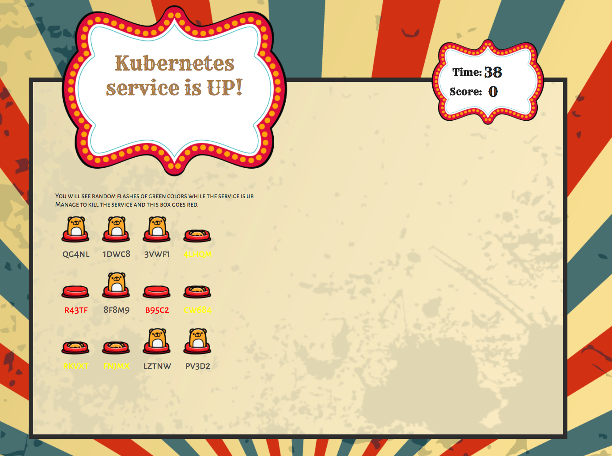
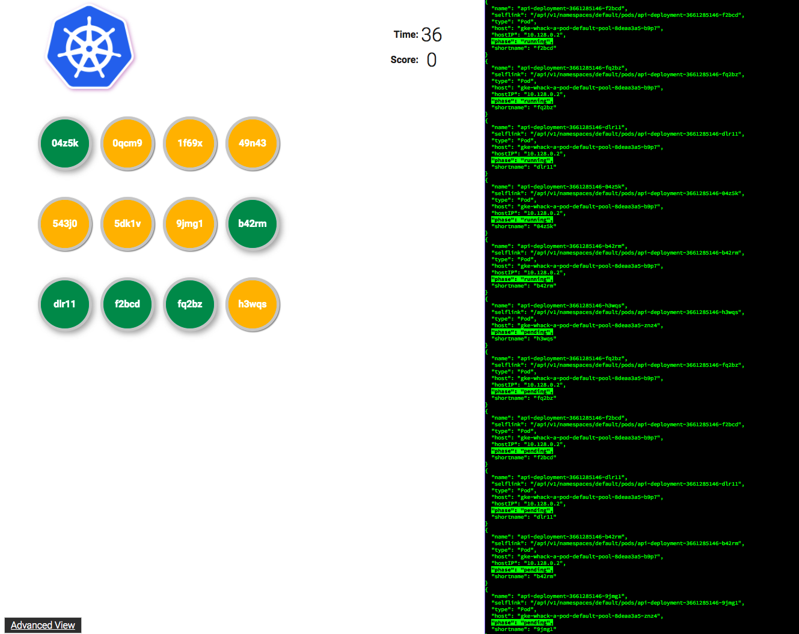
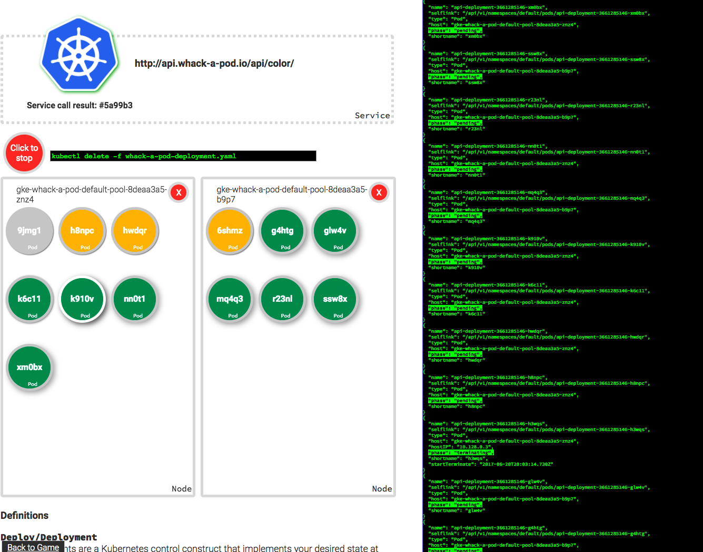

# Whack-a-pod
This is a demo that can be used to show how resilient services running on
Kubernetes can be. Main app shows a giant sign that flashes in various random
colors.  Those colors come a Kubernetes powered microservice.  If the service
goes down, the sign turns red. Your goal is to try and knock the service down
by killing the Kubernetes pods that run the service. You can do that by
whacking the pods wich are respresented as moles.

There is also a less busy verison of the game available at /next.html. This
version has an advanced mode that allows someone to do a more visual
explanation of the mechanics.

The advanced version allows you to track the pod that is serving the color
service and to simulate creating and destroying nodes.

## Getting Started

The current directions assume you are using Google Cloud Platform to take
advantage of Container Engine to build a manage your Kubernetes cluster.  There
is nothing preventing this app from *running* on a Kubernetes cluster hosted
elsewhere, but the directions for setup assume Container Engine. If there is
significant interest in these directions, I'll be happy to publish them (or
better yet, accept a pull request.)

### Create and configure GCP project
1. Create Project in Cloud Console
1. Navigate to Compute Engine (to activate Compute Engine service)
1. Navigate to the API Library and activate Container Builder API

### Create Configs 
1. Make a copy of `/Samples.properties`, renamed to `/Makefile.properties`
1. Alter value for `PROJECT` to your project id
1. Alter `ZONE` and `REGION` if you want to run this demo in a particular area.
1. Alter `CLUSTER` if you want to call your cluster something other than
`whack-a-pod`.
1. Set `INGRESSNAME` if you need to use something other than the default. 
1. Set `DOCKERREPO` if you need to use something other Google Container Registry. 
1. Open a terminal in `/`.
1. Run `make config` to create your ingress file. 
1. This should create the following file:
     1. /apps/ingress/ingress.yaml

>I use this application to show off Google Cloud Platform, so I tend set it up
multiple times, once per region or datacenter. Therefore, I rename the `INGRESSNAME` and
`CLUSTER` a bunch. If you only have one cluster, you don't have to fiddle with 
these. 

### Build Infrastructure
1. Open a terminal in `/infrastructure/`.
1. Run `make build`.
`make build` will do the following:
    1. Create Kubernetes Cluster
    1. Create 1 static ip addresse for use in the app

>If you get the error `ResponseError: code=503,
message=Project projectname is not fully initialized with the default service
accounts. Please try again later.` You need to navigfate to Compute Engine in
Google Cloud console to activate Compute Engine service.

     

### Build Application
1. Open a terminal in root of whack_a_pod location.
1. Run `make build`
1. Run `make deploy`
1. When process finishes Browse to the the IP address value for the ingress.
1. To get that address: `gcloud compute addresses describe #INGRESSNAME# --global`

## Run demo
There are two skins to the game.
1. Carnival version:
    *  http://[gamehost]/
1. Google Cloud Next branded version:
    * http://[gamehost]/next.html
    * http://[gamehost]/advanced.html

The advanced version of the game is a great demo for teaching some of the
fundamentals of Kubernetes.  It allows you to cordon and uncordon nodes of the
Kubernetes cluster to simulate Node failure. In addition it shows which Pod of
the Replica Set is actually answering calls for the service.

### Clean Up
1. Open a terminal in `/`.
1. Run `make clean`
1. Open a terminal in `/infrastructure/`.
1. Run `make clean`

## Minikube
Whack a Pod can run on Minikube.  Its performance isn't stellar, but the game
versions of it run just as well a it does on a flaky conference wifi. 

### Prerequisite 
* Install minikube  
[Directions](https://github.com/kubernetes/minikube/releases) 
* Enable ingress  
`minikube addons enable ingress`
* Install xhyve driver (Mac OS])  
[Directions](https://github.com/kubernetes/minikube/blob/master/docs/drivers.md)  

### Docker Repository
You can use the Container Registry based commands in the Makefiles to build and
host your Docker images.  

1. Open a terminal in root of whack_a_pod location.
1. Run `make build`
1. Make images publicly available by following [these directions](https://cloud.google.com/container-registry/docs/access-control)

This still requires a Google Cloud Platform Project.  If you would like to build 
them some other way, you can, nothing restricts you from doing so. Just make 
sure you set `$(DOCKERREPO)` to the right value in Makefile.properties.

### Running on Minikube

1. Open a terminal in root of whack_a_pod location.
1. Run `minikube start --vm-driver=xhyve`
1. Run `make deploy.minikube`
1. Run `kubectl describe ingress` to get the IP address of the ingress.
1. Create an entry in /etc/hosts pointing IP address to `minikube.wap`.   

### Clean Minikube
1. Run `make clean.minikube`
1. Run `minikube stop`

### Running on any Kubernetes (generic)

This method is for generic usage and can be run on any Kubernetes installation. There are few differences:
* It will push built images to repo `DOCKERREPO` defined in Makefile.properties
* It's agnostic of any loadbalancer in front of ingress so you can use `NodePort` type for ingress service
* It works with RBAC model - proper serviceaccount and role bindings are created
* It will deploy all objects in current namespace

1. Open a terminal in root of whack_a_pod location.
1. Build application with `make build.generic` **OR** skip building by setting `DOCKERREPO` to **cloudowski** and use prebuilt images availabe on dockerhub
1. Run `make deploy.generic`
1. Define name `whackapod.example.com` in your `/etc/hosts` pointing to IP address of your load balancer in front of ingress controller or one of nodes IP (when using `NodePort`)
1. Open your browser at [http://whackapod.example.com/](http://whackapod.example.com)

### Clean generic deployment
1. Run `make clean.generic`

## Architecture
There are three Kubernetes services that make up the whole application:
1. Game
Game contains all of the front end clients for the game, both the carnival
version and the Google Cloud Next version.
1. Admin
Admin contains all of the logic for managing the whole application.  This is
the application the front end calls to get a list of the pods running the
color api, it also has calls to create and delete deployments, delete pods, and
drain and uncordon nodes.
1. Api
Api contains two service calls: color and color-complete. Color is a random
hexidecimal RGB color value. Color-complete is the same as color, but also
sends the pod name of the pod that answered the service call.

"This is not an official Google Project."
